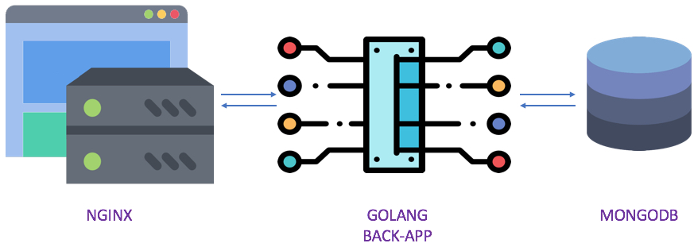

# An example of Docker Stack deployment of a Golang RESTful API connected to MongoDB, behind an NGINX proxy




## Introduction

This repository is part of my blog post on [Docker golang rest mongodb nginx](http://www.it-wars.com/posts/virtualisation/docker-exemple-golang-mongodb-rest-api/).

## Howto build a REST API using Golang connected to a NOSQL MongoDB Database and protected behind a NGINX proxy

To illustrate this purpose, I built a *golang app* that serve and store informations from *MongoDB*

Get app status:

```bash
curl -k -H "Content-Type: application/json" https://<your ip>/app-back-status 2>/dev/null | jq
```

Store new record:

```bash
curl -k -d '{"nom":"RABAH", "prenom":"Vincent", "telephone":"0000000"}' -H "Content-Type: application/json" -X POST https://<your ip>/contacts
```
